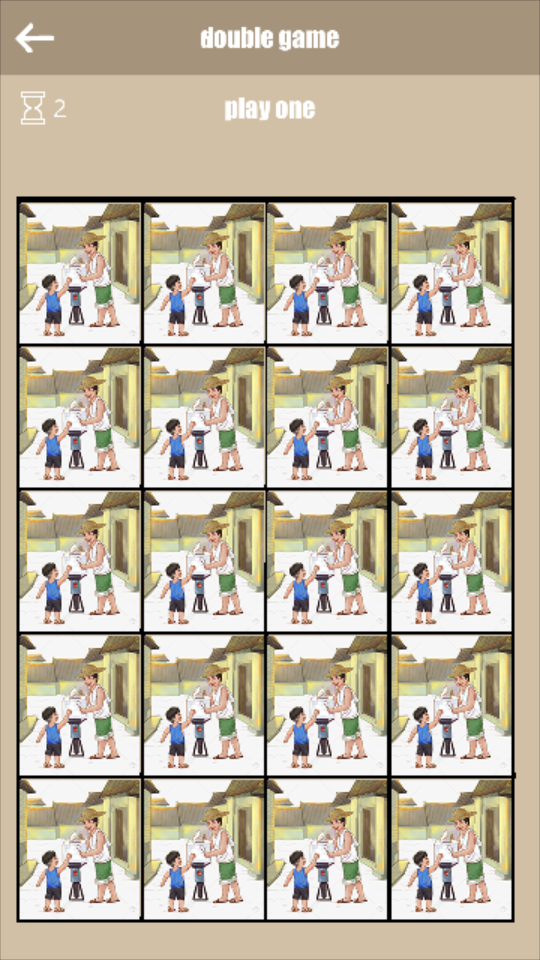

# Gdx-Game

计划收集小时候的游戏，巩固gdx的知识，下个案例游戏计划使用gdx物理引擎。

## 动物游戏

小時候玩的一個游戲，現在使用Gdx實現，目前計劃是，準備兩個，一個是本地玩，一個是連機玩。

## 玩法

游戏由10个动物名字组成，玩家分为两个，他们各持不同颜色的动物进行。他们通过相互吃掉对方，最后还有动物的一方胜利。

### 动物种类

1 象，2 狮，3 猪，4 熊，5 虎，6 豹，7 狗，8 狼，9 猫，10 鼠

### 开局

开局两个玩家，分别拿取两个不同颜色的动物（一般由红黑，这个由提前预设区分，只作为区分），玩家先翻到的动物颜色是本局的颜色。

### 想吃方式

相同的动物可以同归于尽（或者只是对方消失），编号小的可以吃掉编号大的，10除外，10可以吃1，1可以吃其他2-9，可以和1同归于尽。

## 项目搭建

使用gdx搭建，计划在desktop和Android，其他平台不考虑。

## 使用框架

libgdx  +  kryo，网络的使用，本案例的网路使用server和client.

#### net测试

server代码：

```java
public class ServerDemo {
    public static void main(String[] args) {
        //创建服务
        Server server = new Server();
//        开始服务
        server.start();
        try {
            //绑定端口
            server.bind(2001,3001);
//            注册发送数据的类型
            Kryo kryo = server.getKryo();
            kryo.register(Message.class);
            kryo.register(int[].class);
            server.addListener(new Listener() {
//                接收数据
                @Override
                public void received (Connection connection, Object object) {
                    connection.sendTCP(new Message());
                    System.out.println(((Message)object).toString());
                }
//                链接上执行
                @Override
                public void connected(Connection connection) {
                    super.connected(connection);
                }
//              断开执行
                @Override
                public void disconnected(Connection connection) {
                    super.disconnected(connection);
                }
            });
        } catch (IOException e) {
            e.printStackTrace();
        }
    }
}
```

client代码

```java
public class ClientDemo {
    public static void main(String[] args) {
        Client client = new Client();
        client.start();
        Kryo kryo = client.getKryo();
        kryo.register(int[][].class);
        kryo.register(int[].class);
        kryo.register(Message.class);
        try {
            client.connect(5000, "127.0.0.1", 7001,7002);
        } catch (Exception e) {
            e.printStackTrace();
        }

        client.addListener(new Listener() {
            @Override
            public void received (Connection connection, Object object) {
                if (object instanceof Message)
                System.out.println("client message:"+((Message)object).toString());
            }

            @Override
            public void connected(Connection connection) {
                super.connected(connection);
            }

            @Override
            public void disconnected(Connection connection) {
                super.disconnected(connection);
            }
        });

        Scanner scanner = new Scanner(System.in);
        scanner.next();
    }
}

```

传输的bean类：

```java

package com.kw.game;

public class Message {

    private int arr[];
    private VectorPosition position;

    public int[] getArr() {
        return arr;
    }

    public void setArr(int[] arr) {
        this.arr = arr;
    }

    public VectorPosition getPosition() {
        return position;
    }

    public void setPosition(VectorPosition position) {
        this.position = position;
    }
}
```

局网里面发现服务器：

不用使用网络或者校园网的路由器进行测试，他们是发现不了的，但是是可以通信的。

```java
client.discoverHost(7002,1000);  端口和尝试的时间
```

### 场景

欢迎load场景，主页面场景，游戏场景整体分为3个场景，开发阶段在桌面上进行。最后在android上实现。

### 关于音效

### 关于合图

使用gdx的官方工具合图，然后将图片压成webp,达到压包的作用。去libgdx下载就是了。

还有一种是代码合图：

```java
static String[] atlasFileName = {"main"};

    private static void texturePack() {
        TexturePacker.Settings settings = new TexturePacker.Settings();
        settings.pot = false;
        settings.maxHeight = 2048;
        settings.maxWidth = 2048;
        settings.duplicatePadding = true;
        settings.paddingX = 8;
        settings.paddingY = 8;
        settings.edgePadding = true;
        settings.bleed = true;
        settings.combineSubdirectories = true;
        settings.format = Pixmap.Format.RGBA8888;
        settings.filterMag = Texture.TextureFilter.Linear;
        settings.filterMin = Texture.TextureFilter.Linear;
        settings.useIndexes = false;
        settings.stripWhitespaceX = true;
        settings.stripWhitespaceY = true;
       processAndroid(settings);
    }

    private static void process(TexturePacker.Settings setting,String srcDir) {
        TexturePacker.process(setting, "../../Assets/spine/" + srcDir + "/", "../../Assets/atlas/", srcDir);
    }

    private static void processAndroid(TexturePacker.Settings setting) {
        for (int i = 0; i < atlasFileName.length; i++) {
            String input = atlasFileName[i];
            if (input == null) return;
            try {
                TexturePacker.process(
                        setting,
                        "../../Assets/" + input + "/",
                        "image/" ,
                        input);
            } catch (Exception e) {
                e.printStackTrace();
            }
        }
    }
}
```


## 总结

可以学到基本的开发步骤，学会压图，压包，音效的使用，局域网的基本开发。

## 下一个案例

打砖块


## 游戏截图


